# Sistema de Marcações de Intereses de Destinos

##Sobre

Trata-se de Um Sistema que faz marcações de Cidades pertencentes a determinados países.

##Demonstração do Sistema

1 - Tela Inicial da Aplicação.
1.1 Dados Pessoais
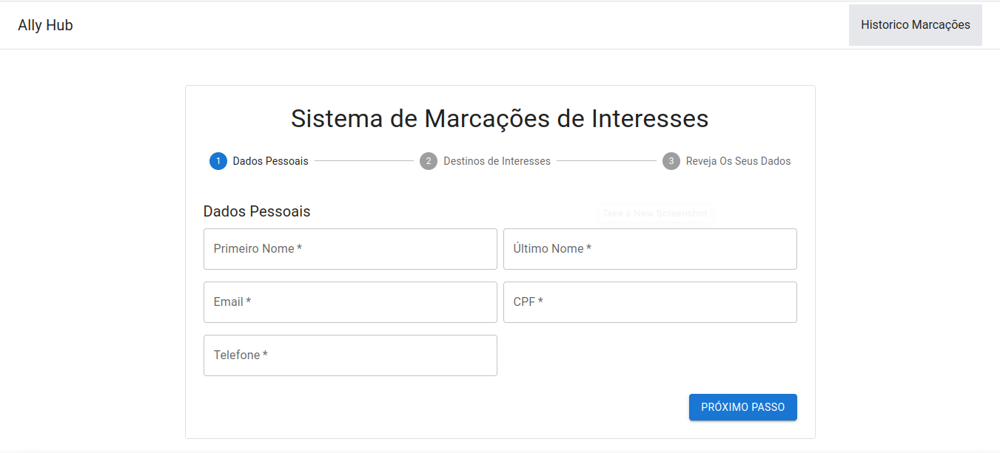

1 - Tela Inicial da Aplicação.
1.2 Dados de Destino
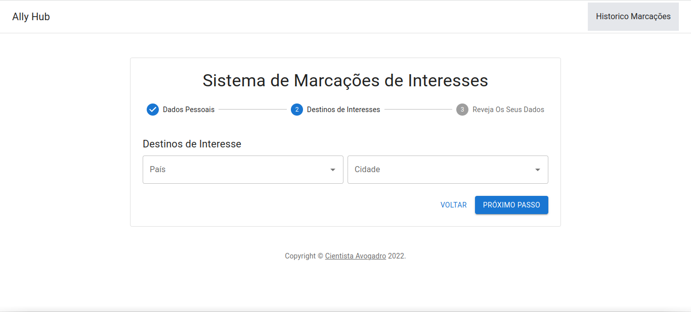
1.2.1 Dados de Destino - preenchido
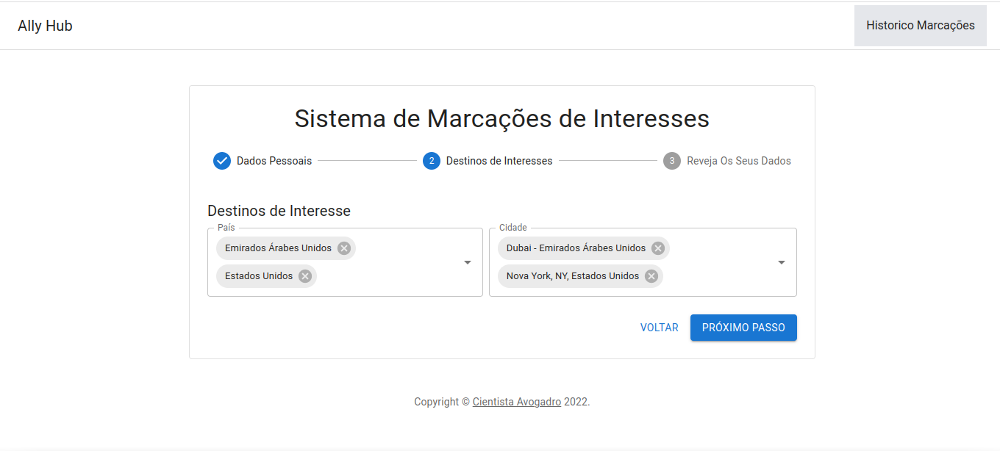

1 - Tela Inicial da Aplicação.
1.3 Revisão dos Dados Escolhidos
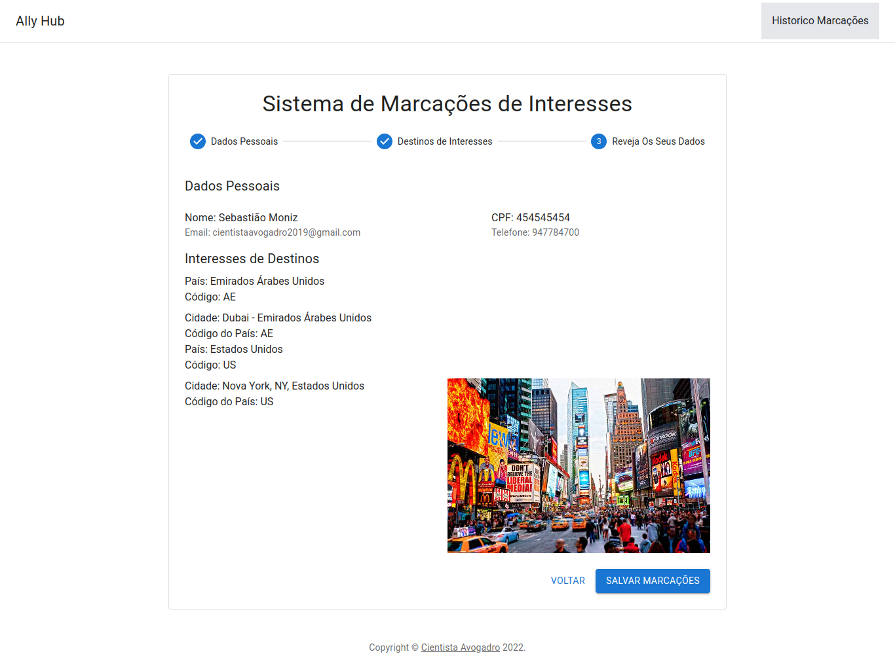
Clicar em Salvar para guardar as suas Escolhas no histórico

1.3 Agradecimento
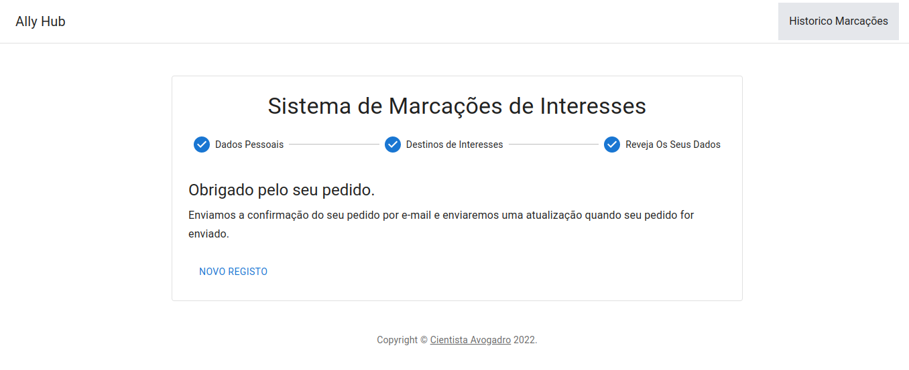
1.3.1 ir para Historico
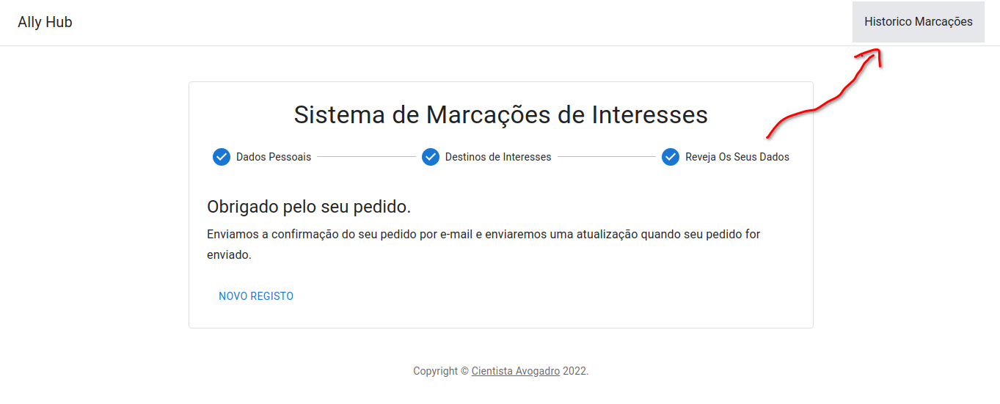

2 - Tela de Históricos de Interesses.
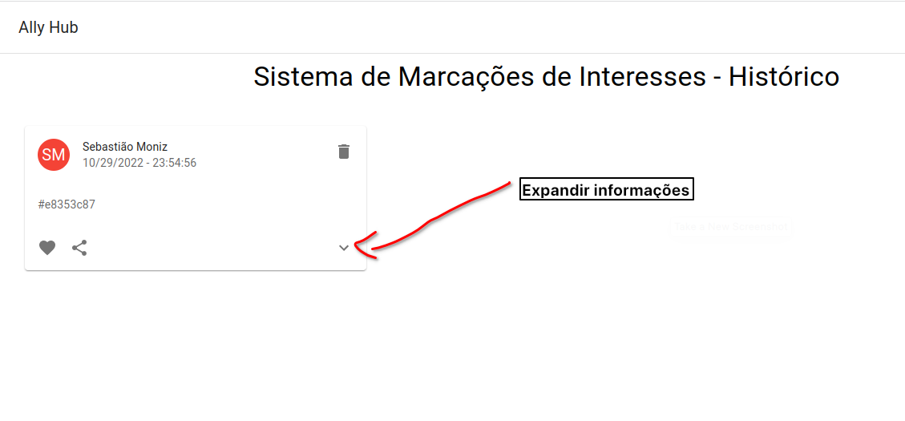
2.1 Expandir Informações
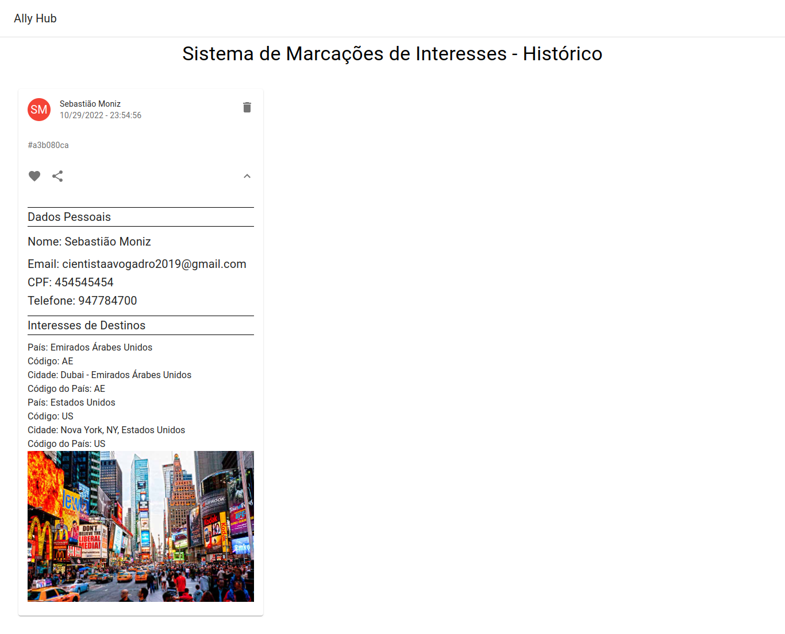

2.2 Apagando Registo
Clicando no Icon De Lixo para deletar
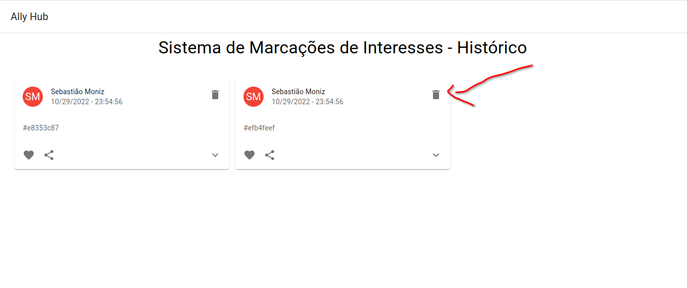

2.3 Informação de quando não ha Histórico
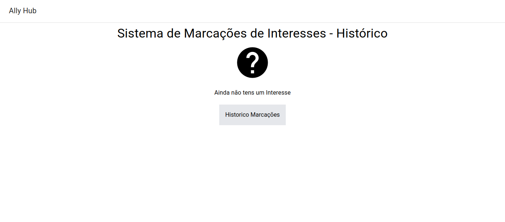

#####Dados Necessários para Marcações de Interesses:

<li>Primeiro Nome</li>
<li>Último Nome</li>
<li>Email</li>
<li>Cpf</li>
<li>Telefone</li>
<li>País</li>
<li>Cidade</li>

## Descrevendo o Sistema:

Todos os campos são Obrigatórios
Ao Escolher um país, no campo cidade vai aparecer apenas as cidades daquele país escolhido
caso escolheres um outro também vai trazer apenas as cidades daquele país marcado
Tudo está automatizado.

### Quais Tecnologias Foram Usadas

- Linguagem de Programação - Javascript com o SuperSet Typescript
- FrameWork - ReactJS (ViteJS - para melhor Desempenho)
- Material UI para o Componentes já Prontos
- UUID para gerar identificadores universais para cada usuário.
- Axios e o tanstack para consumir as Apis
- React-Router-Dom para trabalhar com Rotas
- TailwindCSS para estilização de tags.

### O que é necessário para Rodar o Projecto

1. Primeiro Passo é Clonar o projecto do [github projecto](https://github.com/Cientista-Avogadro/interest-destinations)

   1.1. git clone "link do repos."
   1.2. cd "pasta do projecto"

2. segundo Passo é instalar as Dependências do projecto.
   2.1. yarn ou npm install
3. Último Passo Rodar o projecto
   3.1. yarn dev ou npm run dev

Se pretendes rodar o build da aplicação
No directorio do projecto tem um arquivo dist.zip extrais esta pasta para dentro do project e :

4. yarn preview

caso não tens este arquivo deve-se criar o build:

4.1. yarn build && yarn preview

###Estrutura de Pasta
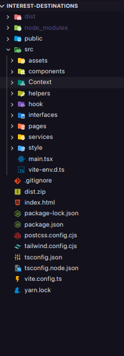

###Desenvolvedor
Este Projecto foi Desenvolvido por Cientista Fenix Avogadro ou simplesmente Sebastião de Sousa Moniz

###Minhas Redes Sociais:

- [Github](https://github.com/Cientista-Avogadro)
- [Linkedin](https://www.linkedin.com/in/sebasti%C3%A3o-de-sousa-moniz/)
- Whatsapp - +244998111798 - para trabalho
- Whatsapp - ++244947784700 - Pessoal
